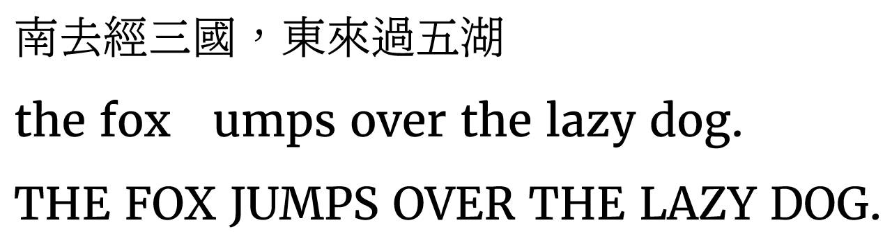

# UDminchoModified

這個專案是在 BLZ UD 明朝體增補成適合繁中與中西文混排的字型

- 根目錄只放最新版本的成品字型
- 參考字型集中放在 `referenceFont`
- 工具腳本集中放在 `tools`
- 報告與 log 集中放在 `reports`
- 舊版輸出與 `.sfd` 備份集中放在 `archive`

## 目前最新版

`KlarMinTC-Regular-GenKiMerriMix-ItalicAlt-v3.ttf`

排版測試優先使用這個檔案。

## 這個版本做了什麼

目前這版字型大致做了這些事：

- 以 KlarMinTC 為底
- 用 `GenKiMin2TW-R.otf` 取代中文標點、注音與多數符號相關字形
- 用 `Merriweather-Regular.ttf` 取代非中文西文標點與符號
- 加入 `Merriweather-Italic.ttf` 的西文斜體替代字形
- 補入高優先缺字，例如 `THIN SPACE`、越南文擴充字母、部分符號與圈號數字

## 斜體的使用方式

這個專案目前不是做「完整獨立 italic 字型檔」，而是把西文斜體作為同一字型中的替代字形。

目前做法：

- 預設西文仍是正常 upright
- 斜體西文放在 OpenType `ss20` feature 裡

這代表：

- 支援 `ss20` 的軟體，可以切到斜體西文
- 不支援 OpenType 樣式集的軟體，可能看不到這個斜體替代

## 如果要重建

從專案根目錄執行：

```powershell
python tools\add_priority_missing_chars.py
```

如果要重新檢查 coverage：

```powershell
python tools\audit_font_coverage.py --target KlarMinTC-Regular-GenKiMerriMix-ItalicAlt-v3.ttf --report reports\font_coverage_audit-v3.txt
```

注意：

- 重建流程執行時，可能會先產生中間檔
- 跑完之後，應該再把中間輸出整理回 `reports` / `archive`
- 根目錄原則上只留最新版成品字型

## 目前專案狀態

手工補完用字

## 建議下一步

如果之後要繼續做，最自然的方向大概是：

1. 決定要不要擴充大量罕用漢字
2. 決定要不要把 Hangul 一起收進來
3. 規劃一個更短、更穩定的正式發布檔名
4. 把「建字型後自動整理資料夾」也一起自動化

## 給人看與給 agent 看的分工

- `README.md`：給人快速看懂專案現況
- `log.md`：給後續 agent / 自動化工作流快速接手專案歷程

如果你是要直接繼續開發、補字、改流程，請先看 `log.md`。


